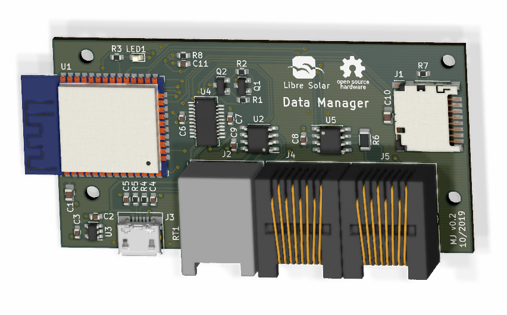

# Data Manager for Libre Solar devices

 Prototype built, development and testing ongoing (especially firmware).

Schematic: [PDF file](data-manager.pdf)

Firmware repository: [LibreSolar/data-manager-firmware](https://github.com/LibreSolar/data-manager-firmware)

## Features

- ESP32 WROOM board for WiFi and Bluetooth connection
- USB Micro-B power supply and debug serial
- microSD card slot
- LS.one interface (UART serial)
- LS.bus interface (CAN)
- Suitable housing: Hammond Mfg. 1591XXAFLBK
